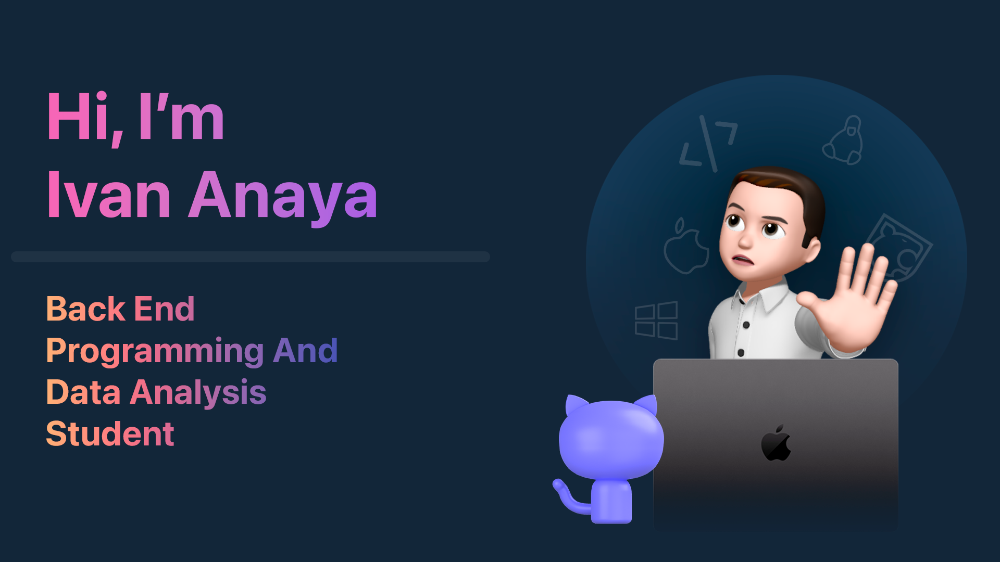

<!--Banner-->

<!--Left image-->

  

<!--Header Name-->

##  ɪ'ᴍ Ivan Anaya! 

*(Student / Developer / Programmer)*
  

<!--Start Intro-->               

Systems Engineering student at Universidad del Valle de Atemajac with a major in software development. In my professional career I have focused on web/software development. 

My skills are focused on Back-End, skills strengthened with updated certifications from Alura. I value innovation and continuous improvement, and strive to collaborate with teams to achieve common goals and maintain high quality standards. Currently, I am preparing to delve deeper into back-end development through a Meta specialization on Coursera. 

- ✨ Student of life :)
- 🧠 I’m currently learning many things, Romans 12:2.
- 💁‍♂️ Student of Systems Engineering at UNIVA
- 💻 Visit my [Portfolio](#) for more details about me.
<!--End Intro-->
---

<!--Languages and Tools Section-->       
<h2 align="center">Technology Stack</h2> 

  

 

<h3 align="left">Current Learning</h3>
<ul align="left">
  <li>Back-End Advance by Meta</li>
  <li>Exploring advanced React.js</li>
  <li>Improving my skills in Data Analysis</li>
</ul>

---

<!--QUOTE--> 
<h2 align="center">💭 QUOTE 💭</h2>

<!--STARTS_HERE_QUOTE_CARD-->

    
  

<!--ENDS_HERE_QUOTE_CARD-->

